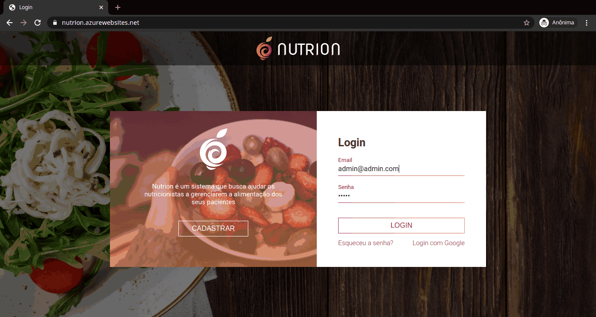

<!-- Logo -->

  

<!-- Badges -->

  
  
  
  
  

<!-- Indice-->

 <a href="#computer-sobre">Sobre</a> •
 <a href="#gear-funcionalidades">Funcionalidades</a> •
 <a href="#wrench-tecnologias-utilizadas">Tecnologias</a> •
 <a href="#art-layout">Layout</a> •  
 <a href="#movie_camera-preview">Preview</a> •
 <a href="#memo-licença">Licença</a>

## :computer: Sobre

O **Nutrion** foi um projeto que desenvolvi em conjunto com meus colegas de faculdade para a disciplina de Tecnologias Web. Seu principal objetivo é o de ajudar nutricionistas a gerenciarem os dados nutricionais de seus clientes.

## :gear: Funcionalidades

- [x] Pacientes
  - [x] Cadastro de paciente - Nome, Telefone, E-mail, Sexo, Data de Nascimento, CPF
  - [x] Edição de paciente
  - [x] Exclusão de paciente
  - [x] Listagem de pacientes
  - [x] Cadastro de físico do paciente
  - [x] Dados físicos do paciente
  - [x] Histórico do paciente
- [x] Alimentos
  - [x] Cadastro de alimentos - Nome, Medida, Tipo de Proteína, Proteína, Carboidratos, Gorduras, Calorias
  - [x] Listagem de alimentos
- [x] Dietas
  - [x] Cadastro de dietas - Nome do paciente
  - [x] Listagem de dietas
- [x] Gerar relatórios de pacientes, alimentos e dietas

## :wrench: Tecnologias Utilizadas

<table>
  <tbody>
    <tr>
      <td align="center">
        
        
HTML

      </td>
      <td align="center">
        
        
CSS

      </td>
      <td align="center">
        
        
Javascript

      </td>
      <td align="center">
        
        
jQuery

      </td>
      <td align="center">
        
        
PHP

      </td>
      <td align="center">
        
        
Doctrine

      </td>
      <td align="center">
        
        
MySQL

      </td>
    </tr>
  </tbody>
</table>

## :art: Layout

### Login

### Dashboard

## :movie_camera: Preview

## :memo: Licença

Este projeto esta sobe a licença [MIT](./LICENCE).
